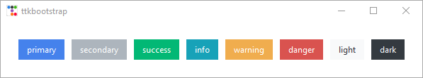
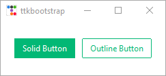

# 0x00 项目介绍

ttkbootstrap 是一个基于 tkinter 的界面美化库，使用这个工具可以开发出类似前端 bootstrap 风格的 tkinter 桌面程序。如果会 tkinter 学习起来就会非常简单，如果不会的话只要先花两三天的时间系统学习一下 tkinter 之后再来使用 bootstrap 也是一样。

ttkbootstrap 不仅有丰富的案例，同时还有完善的官方文档，可惜是英文的。不过对于程序员来说，只要用好翻译软件与提供的案例代码，一样可以轻松上手，那么接下来我们就介绍一下这个工具的使用。


# 0x01 快速上手

首先肯定是需要安装一下 ttkbootstrap 

```shell
pip install ttkbootstrap 
```

然后就可以创建窗口对象了，先看一下官方给的案例

```python
import tkinter as tk
import ttkbootstrap as ttk
from ttkbootstrap.constants import *

# root = tk.Tk()  # 使用 tkinter 创建窗口对象
root = ttk.Window()  # 使用 ttkbootstrap 创建窗口对象

root.geometry('500x300')

b1 = ttk.Button(root, text="Button 1", bootstyle=SUCCESS)  # 使用 ttkbootstrap 的组件
b1.pack(side=LEFT, padx=5, pady=10)

b2 = ttk.Button(root, text="Button 2", bootstyle=(INFO, OUTLINE))   # OUTLINE 是指定边框线
b2.pack(side=LEFT, padx=5, pady=10)

root.mainloop()

```

上面案例分别使用了 tkinter 与 ttkbootstrap 创建窗口对象，实际上运行出来的界面没有太多区别。原因是因为这个案例非常简单，实际上 `ttk.Window` 可以设置非常多的高级属性，相关内容在后续可能会出一个关于 ttkbootstrap 源码解读的视频，到时候再详细介绍。如果你不清楚该怎么选择，推荐使用 `ttk.Window` 的方式进行创建。

第二个需要注意的地方是第 10 行使用 ttkbootstrap 的组件，与默认的组件相比多出了一些属性，其中 bootstyle 是指定按钮的样式。按钮样式有好几种，其中 SUCCESS 是从 ttkbootstrap.constants 的常量当中出来的，除此之外分别还有其他的样式，因为导出来了所以都可以直接使用。



在按钮 b2 中设置 bootstyle 时指定的是一个元组并且添加了 OUTLINE 属性。这个属性是指定边框线关于它的作用我们可以看一个官方案例。

```python
import ttkbootstrap as ttk
from ttkbootstrap.constants import *

root = ttk.Window()

b1 = ttk.Button(root, text="Solid Button", bootstyle=SUCCESS)
b1.pack(side=LEFT, padx=5, pady=10)

b2 = ttk.Button(root, text="Outline Button", bootstyle=(SUCCESS, OUTLINE))
b2.pack(side=LEFT, padx=5, pady=10)

root.mainloop()
```



第二个按钮就是显示边框线的效果


# 0x02 官方文档介绍

## 样式指导（Style guide）

> 官方地址：https://ttkbootstrap.readthedocs.io/en/latest/styleguide/

关于 ttkbootstrap 的组件有非常多，样式也是一样。如果想创建出漂亮的程序界面，最好是把这些组件的文档熟读一遍。或者当不会添加样式使，可以知道到这里进行查询


## 接口文档（API Documentation）

接口文档中记录了 ttkbootstrap  封装的每个组件的参数，并且添加了参数说明。ttkbootstrap 虽然封装了很多好看的组件，但是对于新手根本就不清楚怎么进行使用。这时候就可以查看接口文档，找一下对应的组件是怎么封装的，参数的作用是什么，应该是用那个属性才能达到想要的效果。

接口文档中有丰富的组件与功能，例如时间日期选择、消息提示框、对话框、emoji图像等等，如果是对程序的美观性有要求，非常推荐去看一看。如果只是想要基本的功能，就没必要浪费这个时间与精力了。


## 主题（Themes）

主要展示了 ttkbootstrap 的一些内置主题，并且允许自定义主题。推荐选择一个比较满意的主题直接使用就可以了，没必要使用 TTK Creator 创建一个属于自己的主题。你不嫌麻烦的话可以自己尝试一下。


## 画廊（Gallery）

项目提供的基础案例全部存放在这个里面，整个项目提供了 11 个案例，可以说是非常丰富了。如果你不清楚才能熟练掌握 ttkbootstrap 并且用它做出好看的界面，推荐先从这些案例开始。先把案例搞懂，然后再自己尝试去做新的案例，上手就会非常的快。

但是新手需要注意，这里面的案例不适合新手食用，因为都是基于面向对象进行封装的，如果看不懂建议先把面向对象的基础补一下。 

# 0x03 附录

ttkbootstrap 源码目录结构

```
├─ttkbootstrap
│  │  constants.py
│  │  dialogs.py
│  │  icons.py
│  │  publisher.py
│  │  style.py
│  │  toast.py
│  │  tooltip.py
│  │  utility.py
│  │  widgets.py
│  │  window.py
│  │  __init__.py
│  │  __main__.py
│  │
│  ├─themes
│  │  │  standard.py
│  │  │  user.py
│  │  └─ __init__.py
```

